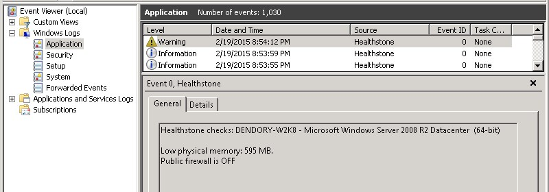
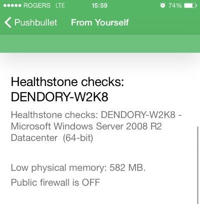

# Healthstone
Healthstone is an open source and lightweight Windows system monitoring service able to run dozens of customizable health checks. If any check fails, it can notify the Event Log, send emails, file a NodePoint ticket, or send a notification using Pushbullet. It runs on any Windows XP, 7, 8, Server 2008 or Server 2012 system. It can be used to monitor servers, or the state of Windows desktops in any environment, along with other services such as IIS, SQL Server, etc.

### Screenshots

### Health checks
* Check if DEP is enabled.
* Check for a specific time zone.
* Check for a specific code page.
* Check for a physical memory threshold.
* Check for a CPU load threshold.
* Check for a CPU temperature threshold.
* Check if the system rebooted recently.
* Check overall system status.
* Check if Windows Update is enabled.
* Check when the last Windows Updates were installed.
* Check if specific updates are installed.
* Check for low disk space.
* Check for a running processes.
* Check if there is an Anti Virus product installed.
* Check if the Anti Virus is disabled or out of date.
* Check if the firewall is off.
* Check if the system booted in safe mode.
* Check for a specific hostname and workgroup/domain membership.
* Check for network connectivity to a specific IP.
* Check if network latency is below a certain threshold.
* Check if a web URL can be loaded without error.
* Check an ODBC database connection.
* Check custom ports.

### Notifications
* Email
* Event Log
* NodePoint Ticket System
* Pushbullet

### Installation
To install, unzip the files in the `bin` folder somewhere and run `install.bat` as Administrator. This will install to `C:\Windows\healthstone` by default and activate the service. To configure it, edit the file `healthstone.cfg` in that folder and restart the service. It requires the Microsoft .NET Framework 3.5 to be installed.

### Compiling the source
The source is in C Sharp inside the `src` folder and is easy to customize. To build it, simply run `make.bat`. You do not need any specific tool other than the .NET Framework 3.5.
