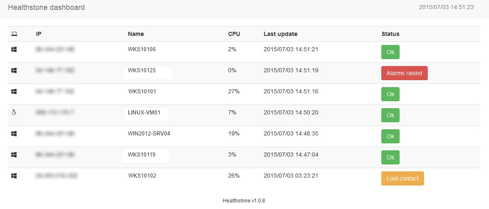
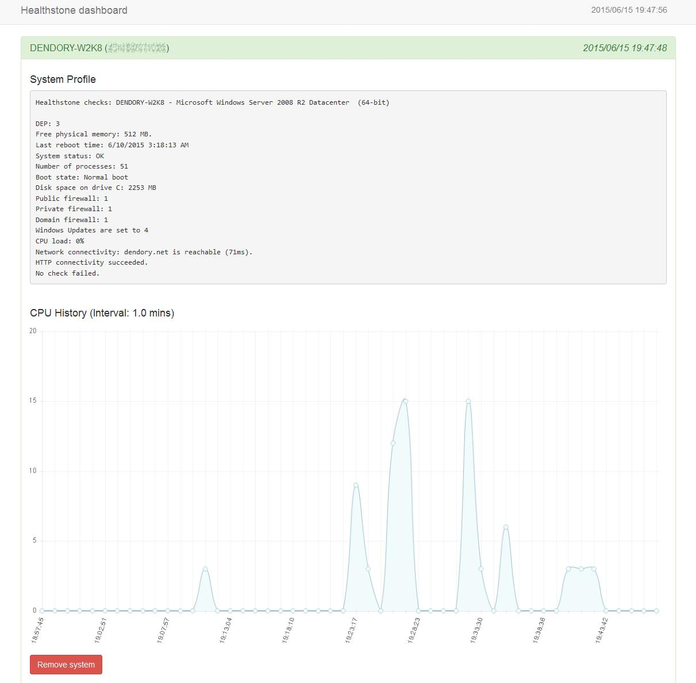

# Healthstone

Healthstone is an open source and lightweight system monitoring solution able to run many customizable health checks. It is composed of a dashboard server which runs on a Windows or Linux server, along with agents for Windows and Linux hosts that you wish to monitor. The Windows agent is a binary which runs as a service and connects to this dashboard, while the Linux agent is a Python script doing the same thing. The dashboard can be customized to send you notifications through email, Pushbullet or NodePoint tickets when a client stops checking in, or if any of the configured checks fails. Configuration is retrieved in the form of templates from the dashboard by all agents. Templates are stored in the templates folder and can be customized for your needs.

### Home page
See [http://healthstone.ca](http://healthstone.ca) for documentation.

### Screenshots

